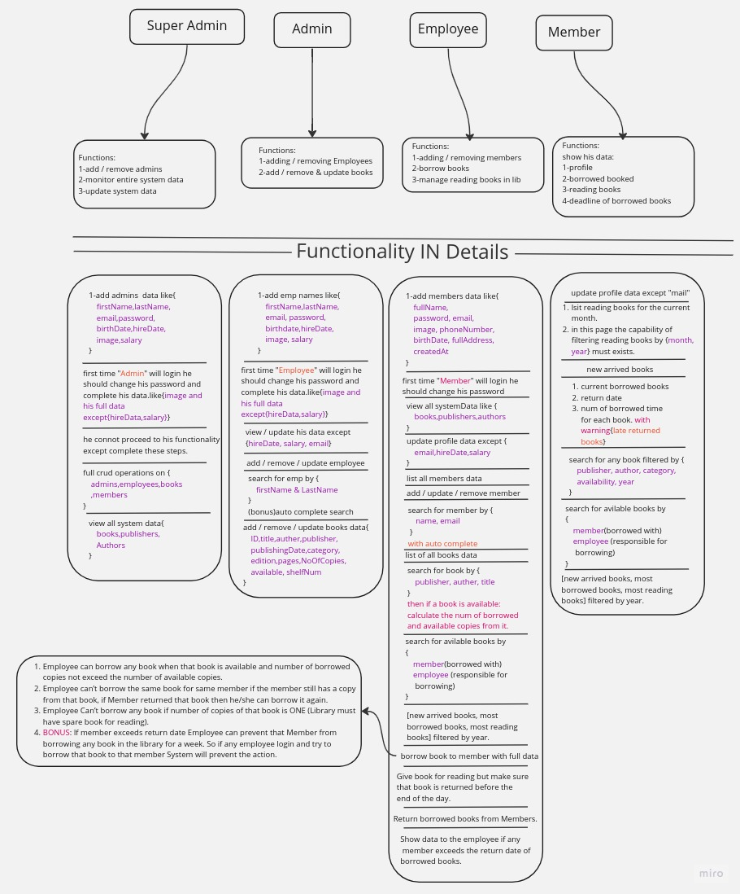

# Library System

This is a library system built in Node.js, designed to manage books and their respective borrowers and readers. The system allows users to search, add, get, update, and delete books and users in a nosql database.

## Features

- Add, get, edit, and delete admins if you're a super admin
- Add, get, edit, and delete employees
- Add, get, edit, and delete members
- Add, get, edit, and delete books
- View detailed information about a specific admin, user or book
- Search for books
- Borrow books to members if you're an employee
- Read books in library
- Check with a daily cron job if members returned books within deadlines otherwise ban them for 1 week

## Getting Started

- Prerequisites
  To run this application, you need to have Node.js and NPM (Node Package Manager) installed on your computer. You can download them from the official Node.js website: https://nodejs.org/en/

## Installation

1. Clone this repository https://github.com/mostafa2080/NodeJs-Project-
2. Run npm install to install the required dependencies

```bash
  npm install
```

3. Run npm start to start the server

### Local mongodb

```bash
  npm start
```

### Atlas mongodb

```bash
  NODE_ENV=production npm start
```

4. Access the api on http://localhost:8080

## Technologies Used

- Node.js
- Express
- MongoDB
- Mongoose
- JsonWebToken
- Bcrypt
- Filesystem
- Middleware
- Cron

# Here is an Image for Planning & Steps :



## Authors

- [@mostafa2080](https://github.com/mostafa2080)
- [@0xosamaa](https://github.com/0xosamaa)
- [@hassanOsama720](https://github.com/hassanOsama720)
- [@Youssef-Abdullahx09](https://github.com/Youssef-Abdullahx09)
- [@Muhammed-saber79](https://github.com/Muhammed-saber79)

## Acknowledgments

This project was developed as part of the ITI Node.js course.
